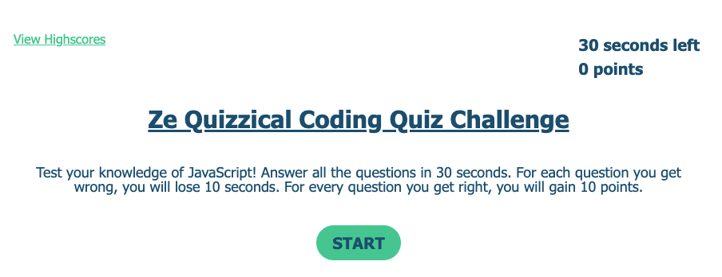
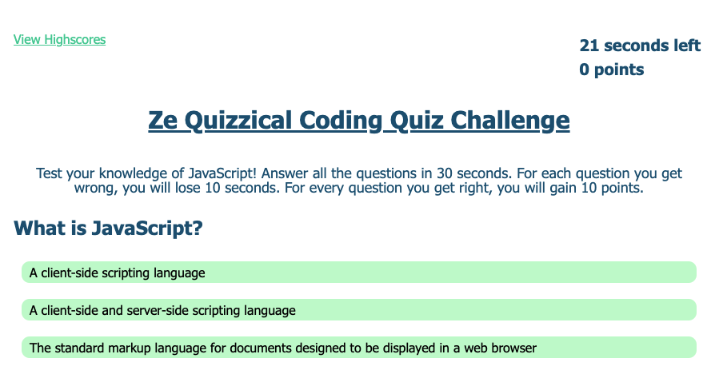
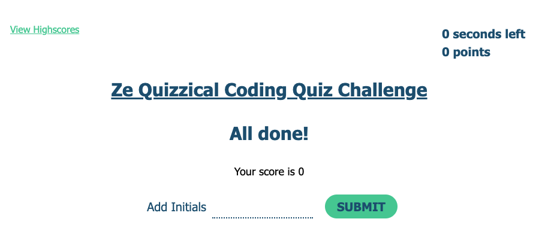

# Ze Quizzical Coding Quiz

> Test your knowledge of JavaScript! Answer all the questions in 30 seconds. For each question you get wrong, you will lose 10 seconds. For every question you get right, you will gain 10 points.
> Live demo [_here_](https://lilyso.github.io/ze-quizzical-coding-quiz/index.html).

## Table of Contents

- [General Info](#general-information)
- [Technologies Used](#technologies-used)
- [Features](#features)
- [Screenshots](#screenshots)
- [Setup](#setup)
- [Project Status](#project-status)
- [Room for Improvement](#room-for-improvement)
- [Acknowledgements](#acknowledgements)
- [Contact](#contact)

## General Information

The project was to create a coding quiz to test the user on their JavaScript knowledge. The quiz is timed and includes a highscore page to track the progress of previous attempts.

## Technologies Used

- HTML5
- CSS3
- JavaScript

## Features

- JavaScript Quiz
- Leaderboard

## Screenshots

## Setup

Download from github repository.

## Project Status

Project is: _in progress_

## Room for Improvement

- More questions needed
- Score and Timer tracker could be more interactive
- When questions exceed 10, user will also gain 10 seconds if the answers are correct to allow more time to answer all questions and add an extra dimension to the quiz.

## Acknowledgements

- Colour scheme generated by [coolors](https://coolors.co/).

## Contact

Created by [@lilyso](https://github.com/lilyso).
